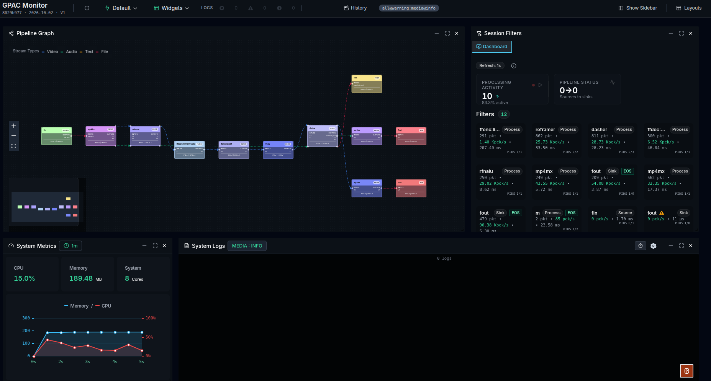
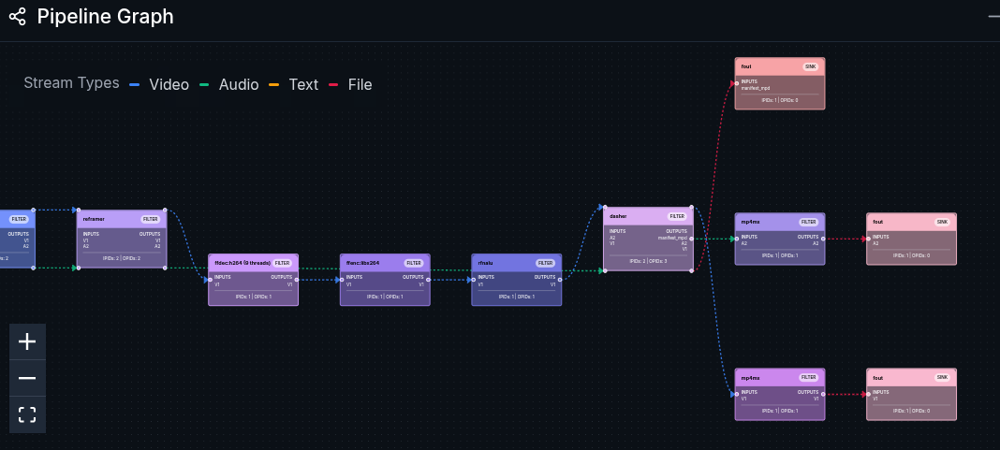
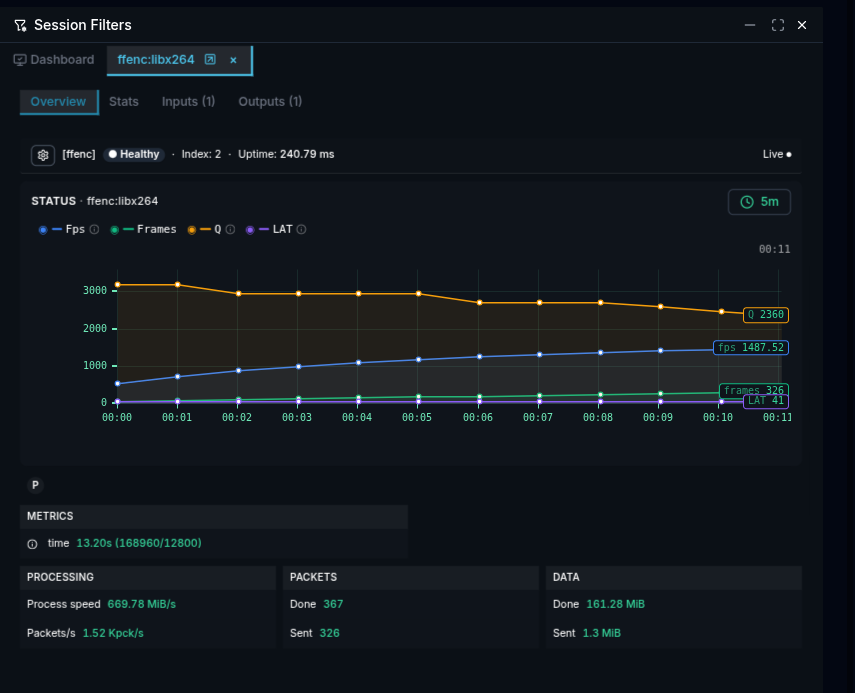
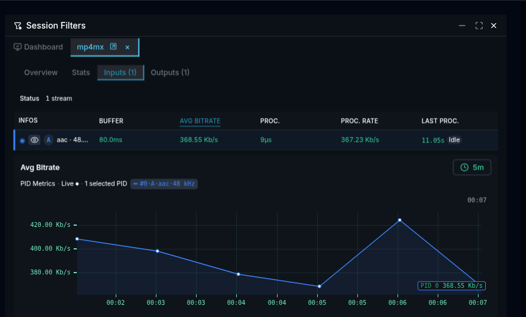
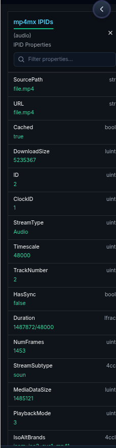
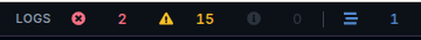
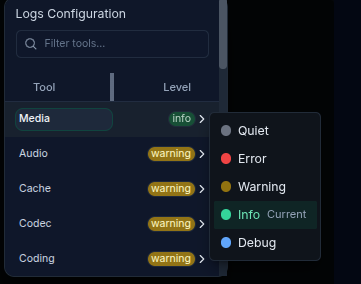
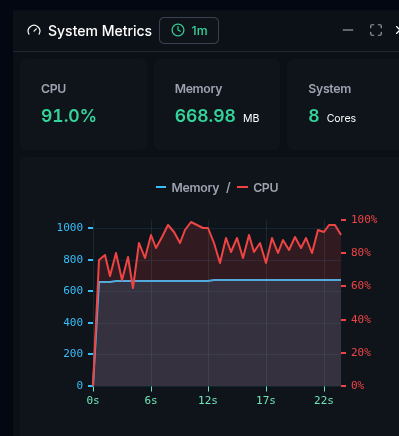
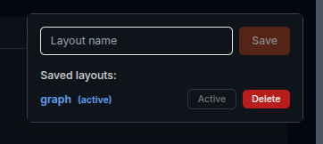

---
tags:
- rmt
- websocket
- session
- filter
- graph
- pid
- log
- metrics
- pipeline
- widget
- history
---

# Before you start {:data-level="all"}

This tutorial starts where [Remote monitoring](remote-monitoring) stops. You know how to start a session with `-rmt` and open the monitoring interface; here you learn to read what it shows, step by step, on a real session.

Start the encoding and DASH packaging example of that page and keep it running during the whole tutorial:

```bash
gpac -i file.mp4 reframer:rt=on c=avc:b=1m -o dash/test.mpd:segdur=2 -rmt
```

# 1. Get the session on screen {:data-level="all"}

Reload the page with the reload button at the left of the connection selector. You should now see the whole session.



# 2. Compare the graph with your command {:data-level="all"}

The **Pipeline Graph** shows more filters than your command names: the extra ones were created implicitly by GPAC to resolve the graph.

Each edge is a connection between two filters, and its color tells which kind of stream it carries: green for audio, blue for video, yellow for text, red for files. At a glance, you see which stream travels through each connection: 



# 3. Open the encoder {:data-level="all"}

Click the encoder node in the graph. The filter opens in its own tab of the **Session Filters** widget, on its Overview tab, next to the Dashboard that lists every filter of the session.



The Status chart plots the values the encoder reports, such as **Fps**, **Frames**, **Q** (quality of the last frame, lower is better) and **LAT** (internal latency: the number of frames the encoder holds, received but not yet output). Click a name in the legend to hide its curve, or to show it again: to follow only **Fps**, click the others. Hover the info icon next to a name to read what it measures.

Below the chart, the P badge shows the type of the last encoded frame (I, P or B). The Packets card counts the packets the encoder received (Done) and output (Sent): their difference is the **LAT** value. The Data card shows the compression at work: the encoder receives raw frames and outputs far fewer bytes.

# 4. Follow a stream {:data-level="all"}

Each edge of the graph carries a stream, a PID. Click an edge that enters a muxer: the muxer opens directly on its Inputs tab, with one line per incoming PID and its statistics: buffer, average bitrate, processing rate, last processing time.



The chart below the table plots one statistic for the selected PIDs. Click a column label, such as **AVG BITRATE**, to choose that statistic. Hover a value to see the related statistics of the same family, and click **+** next to one to plot it. Use the radio button at the left of a PID to add it to the chart or remove it.

{ align=left }

Then click the eye icon of the PID: all its properties open at once, with a search field to find one quickly. Look for the ones you already know about your input file, such as its timescale or duration.

The Outputs tab lists the PIDs the filter produces, with the same statistics. Comparing the two tabs of one filter tells you whether data enters it, and whether it leaves it.

# 5. Check what GPAC reports {:data-level="all"}

Look at the **LOGS** counters in the header: errors and warnings received since the session started. Click a counter to display the corresponding messages in the **System Logs** widget.



To see more about one part of GPAC, open the gear icon of **System Logs**: every GPAC log tool is listed with its level. Raise only the tool you are investigating, for example **Media** to **Info**, and leave the others at **Warning**. The header then shows the active configuration, here `all@warning:media@info`.



# 6. Check resource usage {:data-level="all"}

**System Metrics** shows CPU, memory and the number of cores of the machine. Use it to watch trends while the session runs, for example how the CPU reacts when you change the encoding options of the same command.



!!! note

    On Linux, the CPU value reflects the load of the whole machine, not of the GPAC process only. The memory value is the peak used by the process since it started, so the curve never goes down, even when memory is released.

# 7. Keep your workspace {:data-level="all"}

Move, resize, close or reopen the widgets until the layout suits the investigation, then save it from **Layouts** to restore it the next time you monitor the same kind of pipeline.



To inspect a session after it ends, record it with `-rmt-log` as described in [Session recording](remote-monitoring#session-recording); the replay opens in a separate window, where some header controls are not available.
